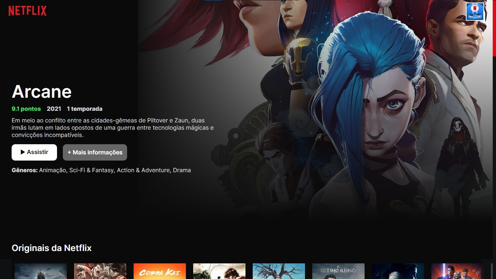

<!---->

# Netflix Clone React.js & Sass + TheMovieDbAPI 🎞️🍿

Esse projeto foi feito por: <strong>Thiago Silva Lopes</strong>, em 04/2022. 
Tendo como base o <a href="https://www.youtube.com/watch?v=tBweoUiMsDg" target="_blank">tutorial</a>
do canal do Youtube: <a href="https://www.youtube.com/channel/UCw9mYSlqKRXI6l4vH-tAYpQ" target="_blank">
Bonieky Lacerda</a>.

## Demo: https://netflix-sass.vercel.app
